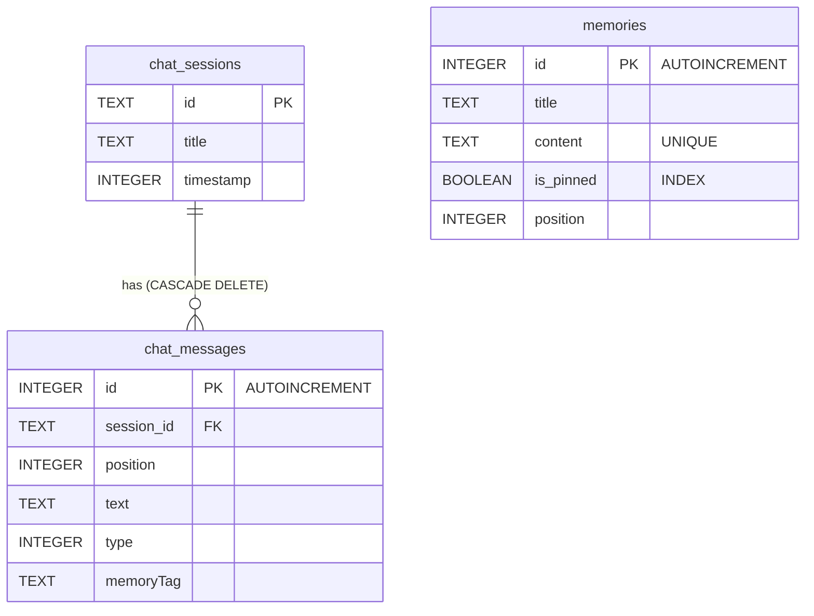

# Database Schema & Data Persistence

Nex V1 persists chat logs and user memory facts locally on the Android device. This persistence layer is built using the **Jetpack Room Library** mapping onto a SQLite database instance. This document details the database schema, entity structures, and migration pathways.

---

## 1. Database Architecture & ER Diagram

The database, named `nex_database`, consists of three entities: `ChatSessionEntity`, `ChatMessageEntity`, and `MemoryEntity`.



---

## 2. Table Specifications

### Table: `chat_sessions`
Stores metadata representing distinct chat windows/conversations.

| Column | Type | Nullable | Description |
| :--- | :--- | :--- | :--- |
| `id` (PK) | `TEXT` | No | Unique UUID generated for each chat session. |
| `title` | `TEXT` | No | Title of the chat (e.g., auto-generated or manual). |
| `timestamp` | `INTEGER` | No | Time (in ms) when the session was created or last updated. |

### Table: `chat_messages`
Stores individual conversation bubbles within a session.

| Column | Type | Nullable | Description |
| :--- | :--- | :--- | :--- |
| `id` (PK) | `INTEGER` | No | Auto-incrementing primary key. |
| `session_id` (FK) | `TEXT` | No | References `chat_sessions.id`. Deleted automatically via `ON DELETE CASCADE`. |
| `position` | `INTEGER` | No | Index of the message in the conversation timeline (ordering). |
| `text` | `TEXT` | No | Text content of the bubble. |
| `type` | `INTEGER` | No | Message sender type (`0 = USER`, `1 = AI`). |
| `memoryTag` | `TEXT` | Yes | Label mapping a message bubble to an extracted memory title. |

- **Indices**:
  - Index on `session_id` to speed up message retrieval.
  - Unique composite index on `(session_id, position)` to enforce chronological consistency.

### Table: `memories`
Stores facts, habits, and preferences extracted from conversation transcripts.

| Column | Type | Nullable | Description |
| :--- | :--- | :--- | :--- |
| `id` (PK) | `INTEGER` | No | Auto-incrementing primary key. |
| `title` | `TEXT` | No | Categorized key (e.g., `"Location"`, `"Programming"`). |
| `content` | `TEXT` | No | Normalized text description of the fact (e.g. `"You prefer Kotlin"`). |
| `is_pinned` | `INTEGER` | No | Flag indicating if this memory is injected into prompt context. |
| `position` | `INTEGER` | No | Order rank for sorting in the memory viewer. |

- **Indices**:
  - Unique index on `content` (SQLite unique constraint) to prevent duplicate facts.
  - Index on `is_pinned` for fast prompt context generation.

---

## 3. Migration History

### Migration: Version 2 → Version 3 (`MIGRATION_2_3`)
This migration added performance and uniqueness constraints to the `memories` table:
1. **Clean Duplicate Data**:
   ```sql
   DELETE FROM memories WHERE id NOT IN (SELECT MIN(id) FROM memories GROUP BY content)
   ```
2. **Apply Constraints & Indices**:
   - Creates a unique index on `content` to prevent duplicate memories:
     ```sql
     CREATE UNIQUE INDEX IF NOT EXISTS `index_memories_content` ON `memories` (`content`)
     ```
   - Creates an index on `is_pinned` for faster context injection:
     ```sql
     CREATE INDEX IF NOT EXISTS `index_memories_is_pinned` ON `memories` (`is_pinned`)
     ```

---

## 4. Concurrency & Executor Operations

Room blocking operations (reads/writes) are strictly isolated from the UI Main Thread.
- **Single-Thread Executor**: Transactions utilize a shared `ExecutorService` (named `dbExecutor`) to ensure database writes are executed sequentially. This prevents SQLite lock contention.
- **Transactional Consistency**: Database operations are wrapped inside `@Transaction` blocks in DAOs (e.g., `replaceSession` deletes and replaces session messages atomically).
