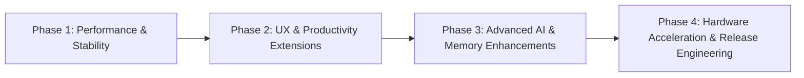

# Nex V1 — Strategic Development Roadmap & Status Summary

This document outlines the structured, phased implementation plan for future enhancements, technical optimizations, and feature additions for **Nex V1**, followed by a comprehensive status summary of completed work.

---

## Part 1: Phased Action Plan & Roadmap

The enhancements are structured in 4 sequential phases, prioritizing performance and user experience first, followed by productivity extensions, advanced AI features, and release engineering.



---

### 🚀 Phase 1: Core Performance, Streaming & Lifecycle Polish `[COMPLETED]`
**Goal:** Eliminate rendering lag during token streaming, reduce garbage collection (GC) pressure, and ensure atomic lifecycle cleanup.

#### 1.1 Incremental Streaming in `ChatAdapter`
- **Problem:** Currently, `updateStreamingText` triggers `bindAiHolder()`, which executes `removeAllViews()`, re-splits text blocks, and re-instantiates code blocks on *every single token*. For long responses, this causes severe layout thrashing and UI stutter.
- **Implementation Plan:**
  - Introduce an incremental text buffer mode for `TYPE_AI` holders during streaming.
  - When actively streaming without code fences (```` ``` ````), update the text directly in the primary `TextView` or append text spans rather than recreating all views.
  - Defer full multi-block syntax highlighting and action button binding until `onResponse()` (stream complete) or when a closed code fence is completed.
- **Files to Modify:**
  - `app/src/main/java/com/k7sunny/nexv1/ChatAdapter.java`

#### 1.2 Eliminate Redundant `PreferenceManager` Allocations
- **Problem:** `new PreferenceManager(context)` is instantiated inside `onBindViewHolder()` and in `triggerHaptic()` during scrolling and button presses, leading to excessive allocations.
- **Implementation Plan:**
  - Inject a single `PreferenceManager` instance via constructor in `ChatAdapter`, `RecentChatAdapter`, `ModelAdapter`, and `MemoryAdapter`.
  - Cache boolean flags (such as `isHapticFeedbackEnabled`) inside adapters or provide a singleton access pattern.
- **Files to Modify:**
  - `app/src/main/java/com/k7sunny/nexv1/ChatAdapter.java`
  - `app/src/main/java/com/k7sunny/nexv1/RecentChatAdapter.java`
  - `app/src/main/java/com/k7sunny/nexv1/MemoryAdapter.java`
  - `app/src/main/java/com/k7sunny/nexv1/MainActivity.java`

#### 1.3 Cancellation & Streaming Finalization Cleanup
- **Problem:** When generation is stopped using `cancelGeneration()`, partial responses may stay stuck in a typing state if the callback doesn't finalize cleanly.
- **Implementation Plan:**
  - Ensure `cancelInferenceNative()` triggers an immediate callback that converts the `TYPE_TYPING` bubble into a finalized `TYPE_AI` bubble with whatever tokens were generated prior to cancellation.
  - Atomically persist the partial text into SQLite via `dbExecutor`.
- **Files to Modify:**
  - `app/src/main/java/com/k7sunny/nexv1/MainActivity.java`
  - `app/src/main/java/com/k7sunny/nexv1/AIManager.java`
  - `app/src/main/cpp/native-lib.cpp`

---

### 🎨 Phase 2: UX, Voice & Productivity Features `[COMPLETED]`
**Goal:** Empower users with voice input, session search, export capabilities, and custom persona presets.

#### 2.1 Voice Input / Dictation (Speech-to-Text)
- **Feature:** Add a microphone button in the chat input bar supporting continuous speech-to-text.
- **Implementation Plan:**
  - Integrate Android's `SpeechRecognizer` API for zero-latency, on-device voice dictation with fallback prompts for microphone permission.
  - Animate the mic icon during listening state with live transcription streaming into `messageInput`.
  - *(Optional Future Extension)*: Offline transcription via bundled `whisper.cpp` NDK library.
- **Files to Create/Modify:**
  - `app/src/main/java/com/k7sunny/nexv1/MainActivity.java`
  - `app/src/main/res/layout/activity_main.xml`
  - `app/src/main/res/drawable/ic_mic.xml`
  - `app/src/main/AndroidManifest.xml` (`RECORD_AUDIO` permission)

#### 2.2 Chat Export & Sharing (Markdown / Plain Text)
- **Feature:** Allow users to export entire chat sessions or share specific turns.
- **Implementation Plan:**
  - Add an **"Export Chat"** action in the toolbar menu and drawer popup.
  - Provide formats:
    - **Markdown (`.md`)**: Preserves `#` headers, tables, code fences, and metadata.
    - **Plain Text (`.txt`)**: Clean dialog transcript.
  - Implement export via `Intent.ACTION_CREATE_DOCUMENT` (Storage Access Framework) and the native Android Share Sheet (`Intent.ACTION_SEND`).
- **Files to Create/Modify:**
  - `app/src/main/java/com/k7sunny/nexv1/HistoryManager.java`
  - `app/src/main/java/com/k7sunny/nexv1/MainActivity.java`
  - `app/src/main/java/com/k7sunny/nexv1/DrawerActivity.java`

#### 2.3 In-Chat Message Search & Global Search
- **Feature:** Search for keywords across past conversations and inside the active session.
- **Implementation Plan:**
  - In `MainActivity`, add an expandable search bar that highlights matching words and provides Next/Previous match navigation with scroll-to-index.
  - In `DrawerActivity`, enhance `recentChatsRecycler` to search message content (FTS) in Room via `@Query("SELECT * FROM chat_messages WHERE text LIKE '%' || :query || '%'")`.
- **Files to Modify:**
  - `app/src/main/java/com/k7sunny/nexv1/data/ChatHistoryDao.java`
  - `app/src/main/java/com/k7sunny/nexv1/HistoryManager.java`
  - `app/src/main/java/com/k7sunny/nexv1/DrawerActivity.java`
  - `app/src/main/java/com/k7sunny/nexv1/MainActivity.java`

#### 2.4 Pre-Configured System Personas
- **Feature:** Persona presets allowing users to quickly switch AI behavior without manually writing system prompts.
- **Implementation Plan:**
  - Create preset definitions:
    - **General Assistant**: Balanced, helpful, concise.
    - **Code Expert**: Focused on clean code, architecture patterns, and debugging.
    - **Creative Writer**: Rich vocabulary, expressive, storytelling.
    - **Socratic Tutor**: Explains concepts through questions and step-by-step guidance.
    - **Custom**: User-defined system prompt.
  - Add a visual Persona Selector in `SettingsActivity` with immediate persistence to `PreferenceManager`.
- **Files to Create/Modify:**
  - `app/src/main/java/com/k7sunny/nexv1/SettingsActivity.java`
  - `app/src/main/res/layout/activity_settings.xml`
  - `app/src/main/java/com/k7sunny/nexv1/PreferenceManager.java`

---

### 🧠 Phase 3: Advanced AI, Local RAG & Knowledge Management `[COMPLETED]`
**Goal:** Expand multimodal and retrieval intelligence to documents and user-curated knowledge.

#### 3.1 In-Line Memory Editor & Categorization
- **Feature:** Allow users to directly view, edit, re-categorize, and organize facts in their Personal Knowledge Base.
- **Implementation Plan:**
  - In `MemoryActivity`, add an "Edit Memory" bottom sheet to adjust Topic Title, Fact Content, and Pinned status.
  - Add category chip filters (e.g. *Personal*, *Work*, *Preferences*, *Plans*) derived from memory topics.
- **Files to Modify:**
  - `app/src/main/java/com/k7sunny/nexv1/MemoryActivity.java`
  - `app/src/main/java/com/k7sunny/nexv1/MemoryAdapter.java`
  - `app/src/main/res/layout/bottom_sheet_edit_memory.xml`

#### 3.2 Offline Document Attachment & Lightweight RAG (Retrieval Augmented Generation)
- **Feature:** Ask questions against local text files, markdown documents, or PDFs.
- **Implementation Plan:**
  - Allow users to attach `.txt`, `.md`, or `.pdf` files from device storage.
  - Extract text chunks (e.g. 500-character windows with 100-character overlap).
  - Use TF-IDF / BM25 lexical ranking or lightweight local embedding GGUF models (`bge-small-en`) to retrieve top 3 relevant chunks and inject them into the inference prompt.
- **Files to Create:**
  - `app/src/main/java/com/k7sunny/nexv1/rag/DocumentParser.java`
  - `app/src/main/java/com/k7sunny/nexv1/rag/LocalRetriever.java`

---

### ⚡ Phase 4: Hardware Acceleration & Release Engineering
**Goal:** Accelerate token generation speed using mobile GPUs/NPUs and harden production builds.

#### 4.1 Vulkan / OpenCL GPU Acceleration in `llama.cpp`
- **Feature:** Leverage mobile Adreno/Mali GPUs to accelerate prompt evaluation and token generation.
- **Implementation Plan:**
  - Update `CMakeLists.txt` to include `GGML_VULKAN=ON` or `GGML_OPENCL=ON`.
  - Add fallback detection: if device GPU initialization fails, gracefully fall back to optimized CPU threads (ARM NEON).
- **Files to Modify:**
  - `app/src/main/cpp/CMakeLists.txt`
  - `app/src/main/cpp/native-lib.cpp`

#### 4.2 ProGuard & R8 Rules for Release Builds
- **Feature:** Ensure minified release builds run without native JNI symbol stripping or Room reflection errors.
- **Implementation Plan:**
  - Add explicit keep rules for all native JNI bridge methods in `AIManager`, `native-lib.cpp`, and Room entities.
- **Files to Modify:**
  - `app/proguard-rules.pro`
  - `app/build.gradle.kts`

---

## Part 2: Current Status Summary

Below is the verified summary of all completed components and architectural systems currently implemented in Nex V1.

```
========================================================================================
                                 NEX V1 STATUS MATRIX
========================================================================================
[COMPLETED] Native Inference Engine (llama.cpp + mtmd) with ARM NEON optimizations
[COMPLETED] Multimodal Vision Subsystem (Qwen2.5-VL 3B + mmproj with token clamping)
[COMPLETED] Token-based KV Cache Reuse across multi-turn sessions
[COMPLETED] Dual-Engine Model Manager (Automatic HuggingFace download + SHA256 integrity)
[COMPLETED] Automated Memory Extraction (Few-shot normalization & identity filters)
[COMPLETED] Context-Aware Dynamic Memory Injection into System Prompt
[COMPLETED] Room Database v4 Persistence (Sessions, Messages, Image URIs, Memories)
[COMPLETED] Auto-Title Generation & Topic Drift Detection with Manual Override Guards
[COMPLETED] Markdown Rendering with Tables (Markwon) & Syntax Highlighted Code Blocks
[COMPLETED] Material 3 UI Redesign (Main Chat, Drawer, Settings, Memory, Account)
[COMPLETED] Inset Padding & Edge-to-Edge Navigation Bar Handling
[COMPLETED] Haptic Feedback Engine & Smooth Dot Bouncing Typing Animation
========================================================================================
```

### Detailed Component Status Breakdown

| Area | Component | Implementation Status | Key Capabilities |
| :--- | :--- | :--- | :--- |
| **Core AI** | `native-lib.cpp` | 🟢 **Complete** | JNI bridge, KV cache reuse, exception boundaries, RAII batch/sampler wrappers, stop-token sanitization. |
| **Multimodal** | Vision Pipeline | 🟢 **Complete** | Qwen2.5-VL 3B + `mmproj`, patch alignment (392px multiple of 28), 256 token clamp, photo picker integration. |
| **Memory** | `MemoryManager` & `AIManager` | 🟢 **Complete** | Fact extraction after user turns, third-person formatting (`[Topic] \| User ...`), deduplication, memory pinning. |
| **Database** | `NexDatabase` (v4) | 🟢 **Complete** | Schema v4 with `ChatMessageEntity` (including `image_uri`), `ChatSessionEntity`, `MemoryEntity`. |
| **UI / UX** | `MainActivity` & `ChatAdapter` | 🟢 **Complete** | Code block copy buttons, copy feedback timers, smart auto-scroll preservation, message delete, regeneration. |
| **Session** | `ConversationAnalyzer` | 🟢 **Complete** | Title generation, topic drift detection, stale callback guards (`titleGenerationInFlight`). |
| **Settings** | `SettingsActivity` & `ModelManager` | 🟢 **Complete** | Multi-model picker (Fast, Pro, Ultra, Vision), model deletion dialogs, parameter sliders (Tokens, Temp, Context). |
