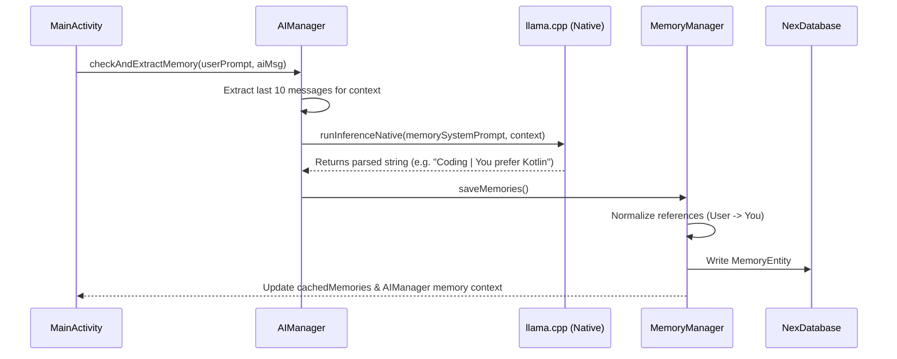

# Personal Memory & Identity Protection System

Nex V1 features a local-first memory pipeline designed to extract personal user details (facts, preferences, hobbies, and locations) and inject them into subsequent chats. This ensures a personalized experience while preserving privacy.

---

## 1. Memory Extraction Pipeline

After every AI response is generated, a background analysis task is triggered to see if the user shared any new personal facts.



### Prompt Constraints
A custom system prompt forces the model to act as a strict classification parser:
- Only extract explicit personal facts or preferences.
- Format strictly as: `[Topic] | You [fact]`.
- Return `NONE` if no personal info is present.
- Never write the word `User` as a proper noun/name.

### Parsing Formats
The system parses the output from the model by checking for delimiters in order:
1. Pipe (`|`)
2. Colon (`:`)
3. Dash (` - `)

If no delimiter is found, the system defaults the title to `"Personal Detail"` and uses the entire parsed output as the fact description.

---

## 2. Identity Protection and Normalization

When using small models, role reversal (hallucinating who is the user and who is the AI) is a common issue. To prevent this, Nex V1 sanitizes how memories are written and loaded.

### Reference Sanitization
In `MemoryManager.java`, the `normalizePersonReference(String content)` method enforces the correct point of view before data is saved or displayed:
- If a fact starts with `"Nex "` or equals `"Nex"`, it is converted to `"I "` or `"I"` (self-referential for the AI).
- If a fact starts with `"User "` or equals `"User"`, it is converted to `"You "` or `"You"` (referring to the human chat partner).

This ensures that when memories are later read by the AI, they are structured from the perspective of the AI talking to the user.

---

## 3. Dynamic Context Injection

Saved and pinned memories are injected into the top of the conversation context during inference.

### Injection Format
In `AIManager.java`, before passing prompt arrays to JNI:
```text
Background facts about the person you are chatting with (referred to below as "you" — this is not your own name or identity):
- You prefer Kotlin over Java.
- You live in Tokyo.
```
This header disambiguates the context, preventing the model from confusing the user's hobbies with its own operational rules.
