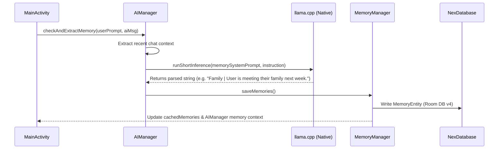

# Personal Memory & Identity Protection System

Nex V1 features a local-first memory pipeline designed to extract personal user details (facts, plans, events, preferences, hobbies, and family/work information) and inject them into subsequent chats. This ensures a personalized experience while preserving complete privacy.

---

## 1. Memory Extraction Pipeline

After every AI response is generated, a background analysis task is triggered to inspect the conversation for new personal facts or plans.



### Prompt Constraints & Few-Shot Guidance
A specialized memory extraction prompt instructs the model to act as a strict classification parser:
- Extracts personal facts, plans, preferences, family/life events, work, or hobbies shared by the User.
- If the user commands *"remember this"* or *"update memory"*, the extractor resolves the referenced plan/fact from prior context.
- Formats strictly as: `[Topic] | User [fact/plan]`.
- Returns `NONE` if no personal facts or plans are present (e.g. general questions or greetings).
- Includes few-shot examples to guarantee consistent output formatting on 0.5B, 1.5B, and 3B models.

### Parsing Formats
The system parses the output from the model by checking for delimiters in order:
1. Pipe (`|`)
2. Colon (`:`)
3. Dash (` - `)

If no delimiter is found, the system defaults the title to `"Personal Detail"` and uses the entire parsed output as the fact description.

---

## 2. Identity Protection and Normalization

When using small models, role reversal (hallucinating who is the user and who is the AI) is a common issue. To prevent this, Nex V1 sanitizes how memories are written and loaded.

### Reference Sanitization
In `AIManager.java` and `MemoryManager.java`, the `normalizePersonReference` method enforces clean third-person formatting:
- `You` / `your` are normalized to `User` / `User's`.
- Content is validated in `MainActivity.java` to strictly reject AI self-referencing statements (`I am an AI...`, `Nex is...`) and prompt instruction leakage.

---

## 3. Dynamic Context Injection

Saved and pinned memories are injected into the top of the conversation context during inference.

### Injection Format
In `AIManager.java`, before passing prompt arrays to JNI:
```text
Background facts about the person you are chatting with (referred to below as "User"):
- User prefers Kotlin over Java.
- User is meeting their family next week.
```
This header disambiguates the context, preventing the model from confusing the user's facts with its own operational rules.
