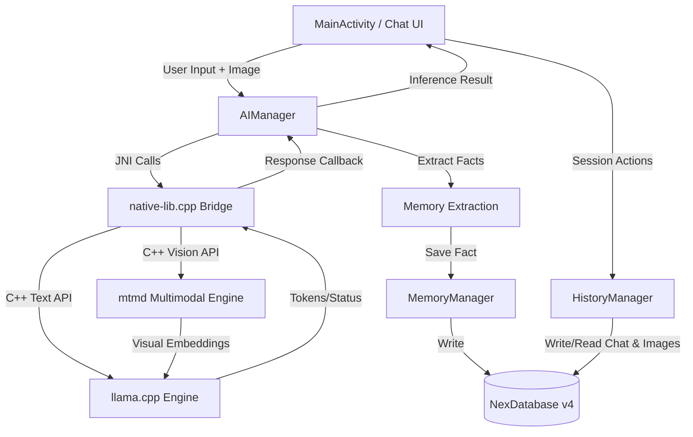

# Technical Architecture & System Design

Nex V1 is a local-first AI chatbot application built for Android. It uses a native C++ engine via JNI (`llama.cpp` + `mtmd`) to run quantized GGUF text and multimodal models directly on-device. This document details the application's components, system flows, and technical choices.

---

## 1. Directory Structure and Package Layout

The Kotlin/Java layer follows standard Android conventions, while the native code is housed in the `cpp` directory:

```text
app/src/main/
├── AndroidManifest.xml
├── cpp/
│   ├── CMakeLists.txt        # Native compilation build script (llama.cpp + mtmd)
│   └── native-lib.cpp        # JNI Bridge and inference logic (text + vision evaluation)
└── java/com/k7sunny/nexv1/
    ├── data/
    │   ├── ChatHistoryDao.java      # Room DAO for chat sessions and messages
    │   ├── ChatMessageEntity.java   # Message database entity (includes image_uri)
    │   ├── ChatSessionEntity.java   # Chat session database entity
    │   ├── MemoryDao.java           # Room DAO for persistent user memories
    │   ├── MemoryEntity.java        # Memory database entity
    │   └── NexDatabase.java         # Room Database configuration and migrations (v4)
    ├── AIManager.java               # Core AI lifecycle coordinator (loads text/vision, handles inference/prompts)
    ├── ModelManager.java            # Manages dual-file model downloads (GGUF + mmproj) and paths
    ├── ConversationAnalyzer.java    # Classification helpers (auto-title & topic-drift evaluation)
    ├── MainActivity.java            # Main interface coordinating chat UI, attachments, threads, and DB state
    ├── MemoryManager.java           # Memory business logic (normalization & legacy migration)
    ├── HistoryManager.java          # Handles persistence of chat sessions, messages, and image attachments
    ├── PreferenceManager.java       # Shared preferences for user context, parameters, and settings
    └── Adapter & UI classes         # ChatAdapter, RecentChatAdapter, ModelAdapter, MemoryAdapter, etc.
```

---

## 2. High-Level Component Flow



---

## 3. Core Component Walkthrough

### MainActivity
Acts as the central controller for the user interface.
- Orchestrates view bindings, drawer menus, session switching, and image attachments (`PickVisualMedia`).
- Downscales attached photos to patch-aligned 392px to prevent mobile memory exhaustion.
- Delegates database operations asynchronously using `dbExecutor` (a single-thread executor) to prevent blocking the Android Main/UI thread.
- Listens to token callbacks streaming from `AIManager` to display real-time inference responses.

### AIManager
Manages the native life-cycle and coordinates model interactions.
- Loads text or multimodal models asynchronously on a high-priority, dedicated worker thread (`nex-inference-thread`).
- Exposes `loadModel()`, `loadVisionModel()`, `generateResponse(prompt, imagePath, callback)`, and JNI bridge declarations.
- Injects system prompts and prepends relevant memory context dynamically from `MemoryManager`.

### ModelManager
Handles model discovery, verification, and automated downloads from HuggingFace.
- Supports single-file text models (`Fast`, `Pro`, `Ultra`) and dual-file multimodal models (`Nex Vision`: base `.gguf` + `mmproj-*.gguf`).

### ConversationAnalyzer
A dedicated wrapper for running lightweight classifier-style inference.
- **Auto-Title Generation**: Periodically scans the first few messages of a session to propose a short, descriptive title.
- **Topic Drift Detection**: Determines if the conversation has shifted topics, recommending a title change if needed.

### HistoryManager & MemoryManager
Intermediary controllers between the SQLite database (`NexDatabase`) and UI.
- `HistoryManager` saves message snapshots including optional `image_uri`.
- `MemoryManager` performs third-person normalization and stores persistent user facts.

---

## 4. Prompt Templating and Memory Injection

In order to construct prompts dynamically, `AIManager` concatenates three primary elements before handing off the request to the native bridge:

1. **System Prompt**: Defined in user settings with memory awareness (e.g., *"You are Nex, a professional offline AI assistant..."*).
2. **Memory Context**: Under `generateResponse`, pinned memories are compiled and formatted:
   ```text
   Background facts about the person you are chatting with (referred to below as "User"):
   - User prefers Kotlin over Java.
   - User lives in Tokyo.
   ```
3. **Chat History**: Multi-turn messages from the active session are stored as lists of `roles` (`"user"` or `"assistant"`) and `contents` arrays. For vision requests, the media marker (`<__media__>`) is embedded within the active turn.

The final payload is formatted inside the native C++ layer using the GGUF model's built-in chat template (`llama_chat_apply_template`) to ensure correct model boundaries.
