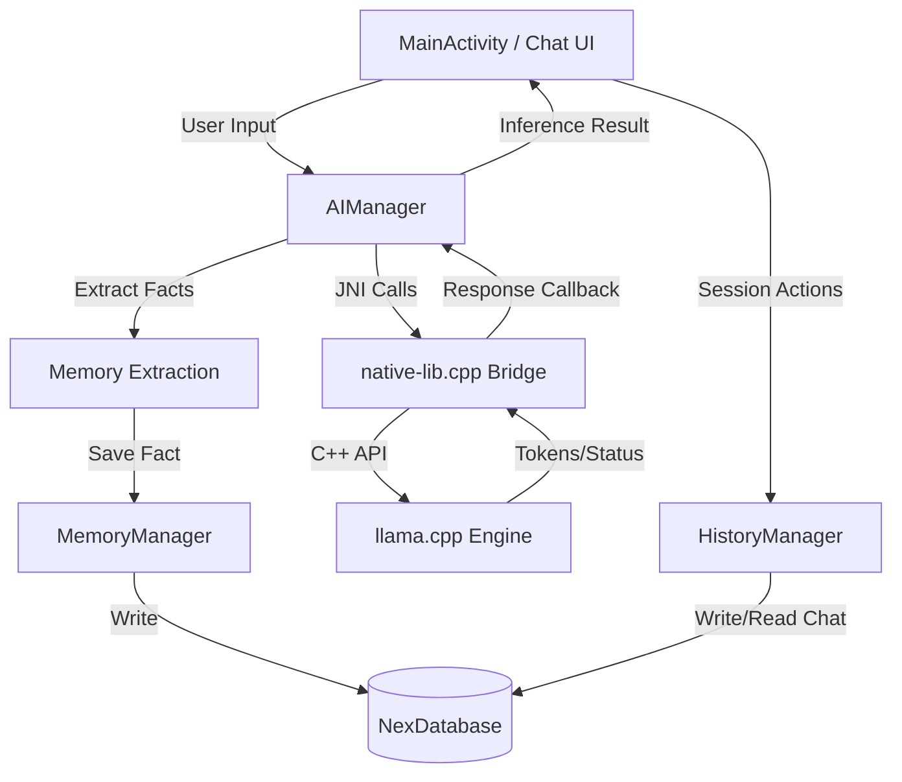

# Technical Architecture & System Design

Nex V1 is a local-first AI chatbot application built for Android. It uses a native C++ engine via JNI (`llama.cpp`) to run quantized GGUF models directly on-device. This document details the application's components, system flows, and technical choices.

---

## 1. Directory Structure and Package Layout

The Kotlin/Java layer follows standard Android conventions, while the native code is housed in the `cpp` directory:

```text
app/src/main/
├── AndroidManifest.xml
├── cpp/
│   ├── CMakeLists.txt        # Native compilation build script
│   └── native-lib.cpp        # JNI Bridge and inference logic (llama.cpp integration)
└── java/com/k7sunny/nexv1/
    ├── data/
    │   ├── ChatHistoryDao.java      # Room DAO for chat sessions and messages
    │   ├── ChatMessageEntity.java   # Message database entity
    │   ├── ChatSessionEntity.java   # Chat session database entity
    │   ├── MemoryDao.java           # Room DAO for persistent user memories
    │   ├── MemoryEntity.java        # Memory database entity
    │   └── NexDatabase.java         # Room Database configuration and migrations
    ├── AIManager.java               # Core AI lifecycle coordinator (loads model, handles inference/prompts)
    ├── ConversationAnalyzer.java    # Classification helpers (auto-title & topic-drift evaluation)
    ├── MainActivity.java            # Main interface coordinating chat UI, threads, and DB state
    ├── MemoryManager.java           # Memory business logic (normalization & legacy migration)
    ├── HistoryManager.java          # Handles persistence of chat sessions and message history
    ├── PreferenceManager.java       # Shared preferences for user context, parameters, and settings
    └── Adapter & UI classes         # ChatAdapter, RecentChatAdapter, ModelAdapter, MemoryAdapter, etc.
```

---

## 2. High-Level Component Flow



---

## 3. Core Component Walkthrough

### MainActivity
Acts as the central controller for the user interface.
- Orchestrates view bindings, drawer menus, and session switching.
- Delegates database operations asynchronously using `dbExecutor` (a single-thread executor) to prevent blocking the Android Main/UI thread.
- Listens to token callbacks streaming from `AIManager` to display real-time inference responses.

### AIManager
Manages the native life-cycle and coordinate model interactions.
- Loads the model asynchronously on a high-priority, dedicated worker thread (`nex-inference-thread`).
- Exposes `loadModel()`, `generateResponse()`, and JNI bridge declarations.
- Inject system prompts and prepends relevant memory context dynamic from `MemoryManager`.

### ConversationAnalyzer
A dedicated wrapper for running lightweight classifier-style inference.
- **Auto-Title Generation**: Periodically scans the first few messages of a session to propose a short, descriptive title.
- **Topic Drift Detection**: Determines if the conversation has shifted topics, recommending a title change if needed.
- **Context Mitigation**: Maps instructions and conversation history into a unified classifier prompt layout to avoid role-play confusion.

### HistoryManager & MemoryManager
Intermediary controllers between the SQLite database (`NexDatabase`) and UI.
- `HistoryManager` saves message snapshots.
- `MemoryManager` performs name-reference normalization and migrates old `SharedPreferences` memory structures to Room.

---

## 4. Prompt Templating and Memory Injection

In order to construct prompts dynamically, `AIManager` concatenates three primary elements before handing off the request to the native bridge:

1. **System Prompt**: Defined in user settings (e.g., *"You are a helpful assistant..."*).
2. **Memory Context**: Under `generateResponse`, if there are pinned memories, they are compiled and formatted:
   ```text
   Background facts about the person you are chatting with (referred to below as "you" — this is not your own name or identity):
   - You prefer Kotlin over Java.
   - You live in Tokyo.
   ```
3. **Chat History**: Multi-turn messages from the active session are stored as lists of `roles` (`"user"` or `"assistant"`) and `contents` arrays.

The final payload is formatted inside the native C++ layer using the GGUF model's built-in chat template (`llama_chat_apply_template`) to ensure correct model boundaries (e.g., ChatML, Llama-3 `<|start_header_id|>`, etc.).
